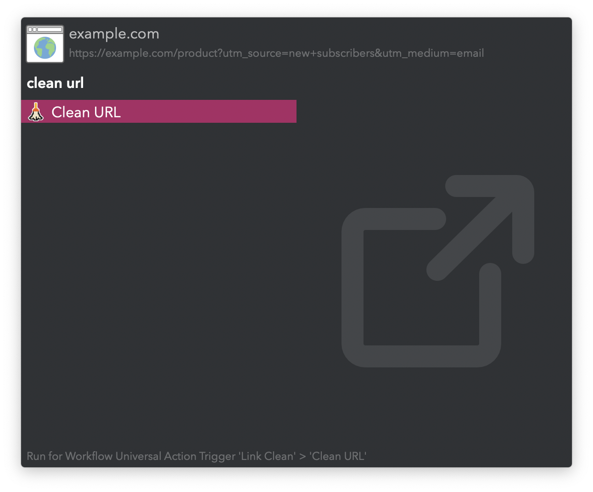
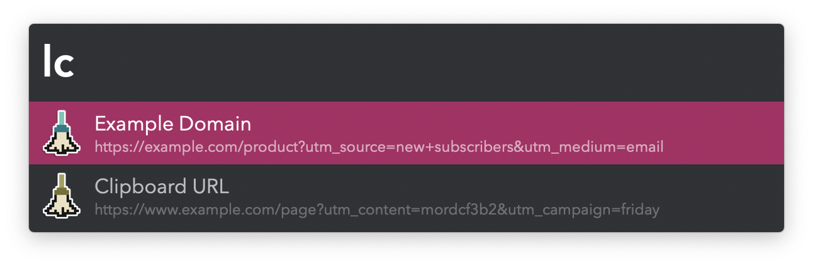

#  Link Clean Alfred Workflow

Remove extraneous information from URLs

[⤓ Install on the Alfred Gallery](https://alfred.app/workflows/vitor/link-clean)

## Usage

Remove tracking parameters, mobile subdomains, and other clutter from URLs via the [Universal Action](https://www.alfredapp.com/help/features/universal-actions/). The result is pasted to the frontmost app.

Alternatively, clean either the last copied URL or the one in the frontmost browser tab via the `lc` keyword.

Configure the [Hotkey](https://www.alfredapp.com/help/workflows/triggers/hotkey/) to clean a selected URL.
